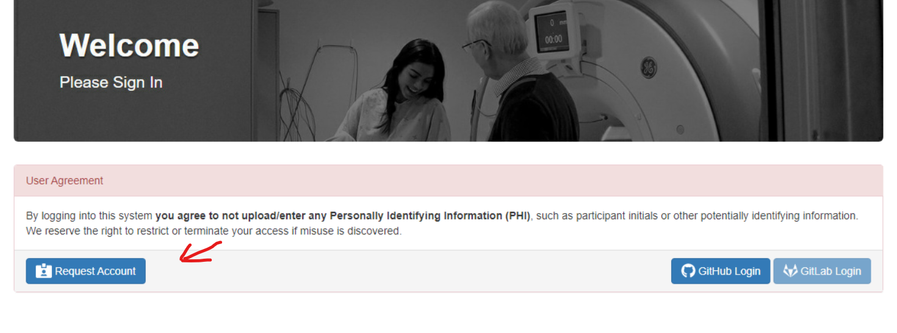

### Who this is for
   - Anyone doing quality control for the lab

### :tada: Intro

The QC Dashboard was developed in the Kimel Lab and released in December 2016 in an effort to better conduct MRI QC. It provides a unified interface for examining individual participant data and communicating issues with others.

## Contents
[Intro](#tada-intro)  
[Logging in](#unlock-logging-in)  
[Navigating the Dashboard](#computer-navigating-the-dashboard)  
:white_small_square:[Overview](#one-overview)  
:white_small_square:[Session QC](#two-session-qc)  
:white_small_square:[Sessions](#three-sessions)  
:white_small_square:[Phantoms](#four-phantoms)  
:white_small_square:[Subjects](#five-subjects)  
[Posting a GitHub Issue, Blacklisting, and Signing Off](#posting-a-github-issue-blacklisting-and-signing-off)  
[Communication](#email-communication)  
[Feedback](#wrench-feedback)  
[Important links](#important-links)  

---

## :unlock: Logging in

The Dashboard is found at http://srv-dashboard.camhres.ca/. This website is only
available on CAMH's network, which means that if you're working offsite you must first log in to https://remote.camh.ca and open Google Chrome through that site before entering the dashboard's URL.

The Dashboard authenticates users via GitHub, so if you do not have a GitHub account you will need to [make one](https://github.com). The first time you access the dashboard, after making your GitHub account, you should click on the request account button, as shown below. This will take you to a page where you can request access for your
GitHub account. Once your account has been approved by an admin, you can return to srv-dashboard.camhres.ca and use the 'GitHub Login' button to login with your github username and password. If you do not receive approval from an admin within 72 hours email us at tigr.lab@camh.ca to ask us for assistance.

---
