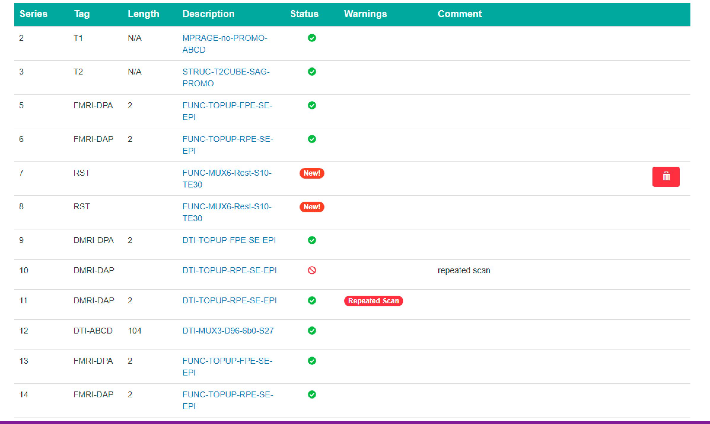

### Who this is for
   - Anyone doing quality control for the lab

### :tada: Intro

The QC Dashboard was developed in the Kimel Lab and released in December 2016 in an effort to better conduct MRI QC. It provides a unified interface for examining individual participant data and communicating issues with others.

## Contents
[Intro](#tada-intro)  
[Logging in](#logging-in)  
[Navigating the Dashboard](#computer-navigating-the-dashboard)  
:white_small_square:[Overview](#one-overview)  
:white_small_square:[Session QC](#two-session-qc)  
:white_small_square:[Sessions](#three-sessions)  
:white_small_square:[Phantoms](#four-phantoms)  
:white_small_square:[Subjects](#five-subjects)  
[Posting a GitHub Issue, Blacklisting, and Signing Off](#posting-a-github-issue-blacklisting-and-signing-off)  
[Communication](#email-communication)  
[Feedback](#wrench-feedback)  
[Important links](#important-links)  

---

## Logging in

The Dashboard is found at http://srv-dashboard.camhres.ca/. This website is only
available on CAMH's network, which means that if you're working offsite you must first log in to https://remote.camh.ca and open Google Chrome through that site before entering the dashboard's URL.

The Dashboard authenticates users via GitHub, so if you do not have a GitHub account you will need to [make one](https://github.com). The first time you access the dashboard you should click on the request account button, as shown below. This will take you to a page where you can request access for your GitHub account. Once your account has been approved by an admin, you can return to http://srv-dashboard.camhres.ca and use the 'GitHub Login' button to login with your github username and password. If you do not receive approval from an admin within 72 hours email us at tigr.lab@camh.ca to ask us for assistance.

---

## Dashboard Basics

### Study View

After logging in you should see a list of studies you have access to. Click on
one to see the study details. If this list is missing a study you need access to contact us at tigr.lab@camh.ca or on slack.

First, on the study home page you may see a box outlining any outstanding QC for the study.

* **Missing Scans** - A REDCap form has been filled out for the ID, but no scan data exists in the archive yet. This means either it has not been uploaded to XNAT or there was an error in transfer from XNAT.
  * If the error has been there for _48 hours or more_ it must be investigated.
  * [See here for details on how to fix it](#missing-scans)

* **Missing REDCap** - Scan data has been received for the ID but a REDCap scan completed form has not been filled out or has an incorrect subject ID. If this error has not disappeared within _48 hours_ of receiving the data it must be investigated.
  * If we have access to the REDCap form: login and search for any forms that may have been misnamed. If one is found, fix the subject ID field and save the form again. The error should disappear when you refresh the dashboard. If none exist, contact the RA who was responsible for entering the form.
  * If we do not have access to the REDCap form: Contact the RA who is meant to enter the data and ask them to investigate.

Next, you may see a 'Nightly Run Log' box showing the most recent run of the nightly pipelines for this study. Error messages in this run log should be resolved as soon as possible, when found. If you're not a Kimel Lab staff member you should contact one promptly to draw attention to any errors. If you are, [see here](#common-issues) for more info on resolving common issues.

Most QC will be done from the 'timepoint' page. Select a session by either clicking on a row from the 'Outstanding QC' window, or by clicking 'Session list' and then clicking on a session ID.

### Timepoint view

- Delete all: Remove everything associated with this timepoint from the archive and/or the dashboard database. Original raw data from the scanner will never be deleted. This button is mainly useful for removing sessions that have slipped through with the wrong ID. [See here for more info](#misnamed-data)
- Flag Incidental Finding: Notify staff members about an incidental finding
- Create issue: Open a GitHub issue to notify staff members about missing data or other QC related issues.
- Comments: Used to hold notes during the QC process or make a record of anything unusual. No notification is sent to staff, it's only for personal record keeping.

- Delete session (trash can icon): Delete a session from the archive and/or dashboard database. This will leave comments and other sessions associated with the timepoint.
- KCNI ID: Session named based on KCNI naming convention (used on XNAT by our lab)
- Task Files: Files related to functional scans where tasks are recorded
- REDCap Comment: RA comments from the scan completed form.
- View Survey: Takes you to the REDCap form filled out for the session
- View Tech Notes (CAMH scans only): the notes from the MRI technician at the time of the scan (Check before MRI Scans).

- Series: Scan Number
- Tag: Type of Scan
- Length: Corresponds to Time or Frames, These values are consistent within each Project
  - Functional Scans: Typically Longer Lengths
  - Anatomical scans: No length applicable
  - DTI: often ~103-104
- Description: The series description taken from XNAT. Click on this to access the scan view.
- Status: New, Signed off, flagged or blacklisted.
- Warnings: Indicates scan issues like repeated scan or header mismatch
- Comment: Displays the comment entered when a scan is blacklisted or flagged
- Delete (trash can icon): Appears on hover. Remove only a particular scan from the archive and/or dashboard database.

- Reached by clicking the series description of a scan in the scan table
- Header differences will display here (if any exist)
- The papaya viewer allows you to scroll through the scan to look for artifacts

## QC Process Checklist
Below is everything to check before signing off on a scan session. For detailed information on how to use the dashboard, [see here](#dashboard-basics)

- [ ] Are all the expected scans there?

  **Solution:**
    * Non-Kimel-Staff: Contact the appropriate staff member. Don't sign off until all scans are located.
    * Kimel Staff: [See here for help](#missing-scans)
- [ ] CAMH Scans Only: Are there any messages in the tech notes?

  **Solution:** Blacklist any scans if instructed to do so in the notes. Copy any tech note messages into the blacklist comment.
- [ ] Is the session mentioned in the nightly run log? That is, are there any unresolved errors in the log associated with the session?

  **Solution:**
    * Non-Kimel-Staff: Contact the appropriate staff member. Don't sign off on the session until all associated errors are resolved.
    * Kimel Staff: [See here for help](#common-issues)
- [ ] Has each individual scan been reviewed?
  - [ ] Does each scan look like a brain? Are there any geometric patterns / new artifacts?

    **Solution:**
      * Non-Kimel-Staff: For new or unexpected artifacts, contact the appropriate RA. For known artifacts flag the scan with a descriptive message.
      * Kimel Staff:
        - Discuss among the group to determine next steps.
        - Ensure the appropriate MRI Physicist is contacted.
  - [ ] Is the whole brain there (cutoff)?

    **Solution:** Flag the scan with a descriptive message.
  - [ ] Do any of the scans have unresolved header differences?

    **Solution:**
      * Non-Kimel-Staff: Contact the appropriate RA
      * Kimel Staff: [See here for help](#header-differences)
  - [ ] Are there any truncated scans (i.e. length field is shorter than expected)?

    **Solution:** Blacklist the truncated series.
  - [ ] Are there repeated scans?

    **Solution:** If only one of the repeated scans is usable, blacklist the others. If all are bad or mediocre flag all of them instead with a descriptive message. Pipelines may be able to average multiple not-great scans to correct the issue.
- [ ] Are there any incidental findings (e.g. tumors, medical anomalies)?

  **Solution:**
    * Non-Kimel-Staff: Contact the appropriate RA
    * Kimel Staff:
      - Discuss among the group to determine next steps
      - Contact Arash Nazeri for further information on the issue
- [ ] Are the distortion maps distorted in opposite directions (i.e. are they different)?

  **Solution:**
    * Non-Kimel-Staff: If the files are distorted in the same direction, contact the appropriate RA.
    * Kimel Staff:
      - Open a Github issue to document the problem
      - Contact the appropriate MRI physicist

---

## Common Issues
This section is for Kimel Staff members to use to help resolve common issues with our nightly pipelines / the dashboard.

### Header Differences

### Missing Scans

### Misnamed Scans
