## Citrix SSO (2FA) Token setup Instructions

Follow the steps below to install, configure and use the Citrix SSO application (app):

Note: Citrix SSO app needs to be configured while in Canada. Attempt to configure/reprovision outside Canada will fail.

### Step 1 - Downloading the mobile app
You will need to use a smartphone, either your personal or CAMH-issued device, to download the Citrix SSO app. You may choose to download the app on whatever device you would prefer, but note that you may only register your credentials on one device.

Download and open the "Citrix SSO" app from the Apple Store or the Google Play Store using your chosen device.

   The app will look like this:

   **IOS**
   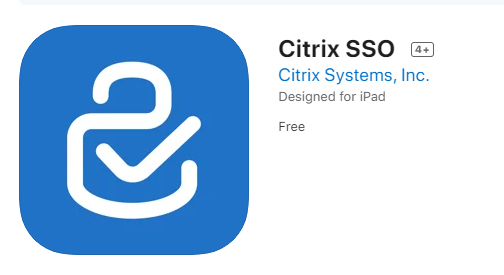

   **Android**
   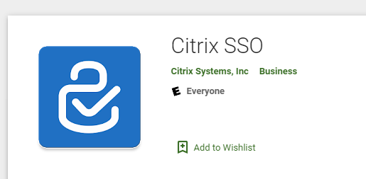

   **Note:**
    Citrix SSO is not supported for

        1. Apple devices where iOS version  is 11.x or lower (in order to work will need version 12.0 or higher)
        2. Android devices where Android version is 6.x or lower (in order to work will need version 7.0 or higher)

### Step 2 - Registering Your Device

1. On your any laptop or desktop, go to: https://whitesquirrel.camh.ca:56011/manageotp

2. Log in using your CAMH credentials (your user name is in FirstName_LastName format.)

   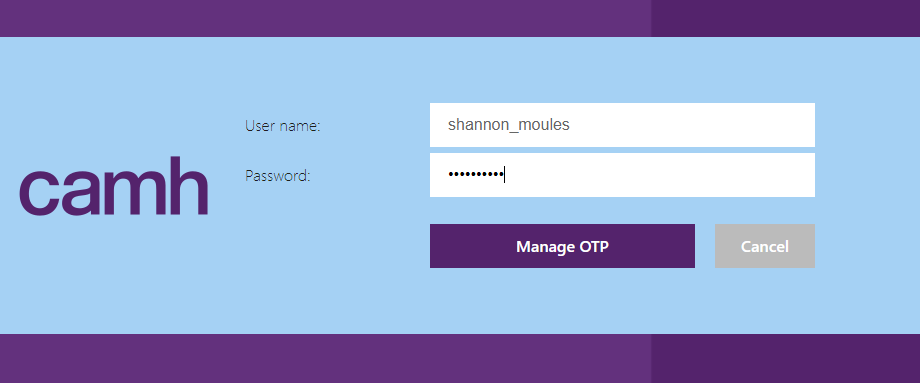

3. Once logged in, select "Add Device"

   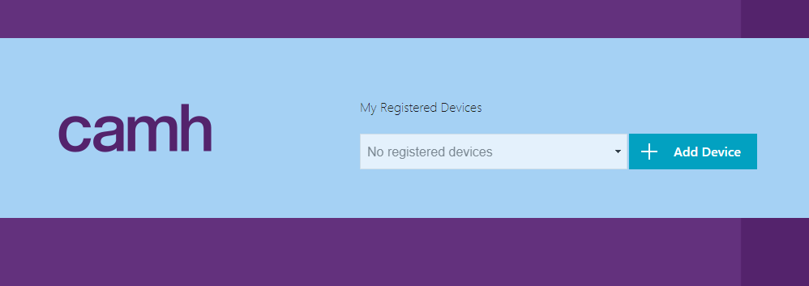

4. Give the new device any name you would like (no punctuation or special characters!), then select "Go".

   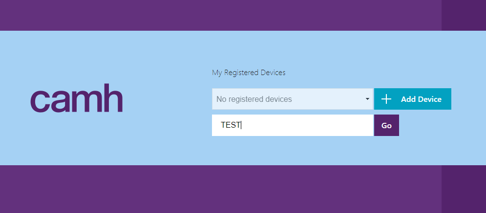

5. A QR code and 26-character code will appear.  **Keep this window open.**

   

### Step 3 - Activating Citrix SSO

1. Using the Citrix SSO app on your smartphone, open the app and select the "Password Token" or "Token" tab on the top right side of your screen.

2. Select "Add New Token" (iOS) or the "+" icon at the bottom of your screen (Android).

   **IOS**
   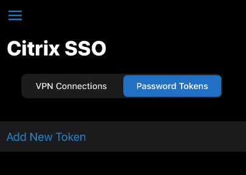

   **Android**
   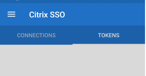

3. A prompt will appear to select either "Scan QR Code". If you select "Scan QR Code", the app will ask for permission to access the phone camera. Select "Yes" or "Agree"

   **IOS**
   

   **Android**
   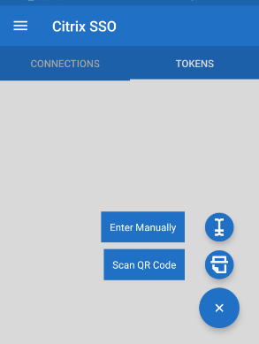

4. A new screen will appear where you will be able to capture the QR code or manually enter the 26-character code to identify you as a CAMH user.

   **IOS**
   

   **Android**
   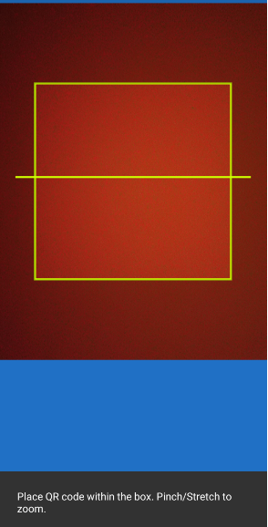

5. On your computer, return to the screen with your QR code and 26-character code. On your smartphone, either scan the QR code that appears on your computer, or enter the 26-character code.

   

6. That's it! You are now registered on the Citrix SSO app.

## How to use Citrix SSO to authenticate yourself
The Citrix SSO mobile app will continuously create a one-time, 6-digit, randomly generated access code. The code is only valid for 30 seconds, after which time, it will randomly generate a new code for you to use.

**IOS**
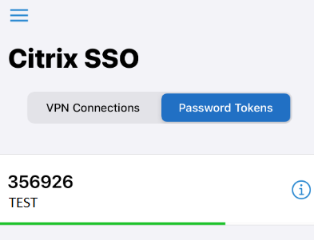

**Android**
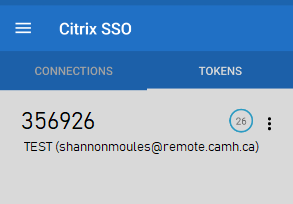

To authenticate yourself when accessing the internal CAMH network on your non-CAMH issued laptop or smartphone, enter the following URL using your web browser: https://remote.camh.ca

Select either "Clinical" or "VPN" access and enter your network user name and password. Open the Citrix SSO app on your smartphone and enter the randomly generated code that appears. Click "Submit".

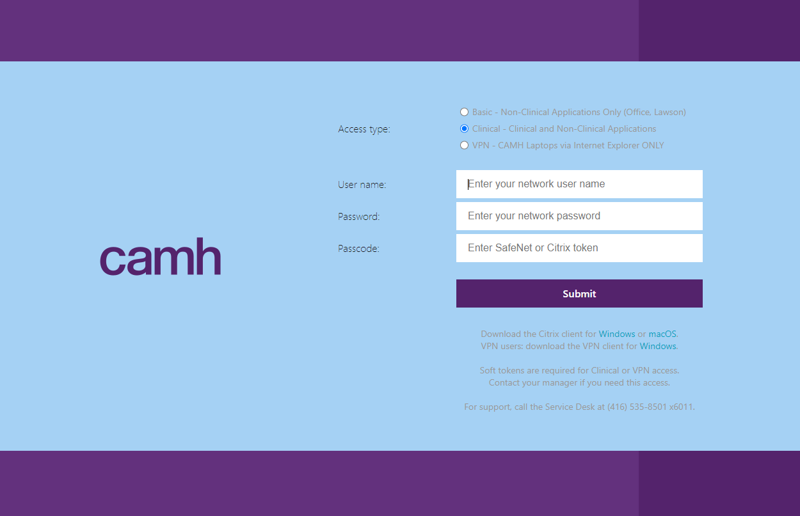

You will now be able to access CAMH's network from your non-CAMH issued laptop or smartphone. If you are not able to log in, the randomly generated code you used may have expired before you submit your request. If that is the case, try again and keep note of the countdown timer that appears next to the code.

If you require assistance or have any questions, please contact service.desk@camh.ca.
