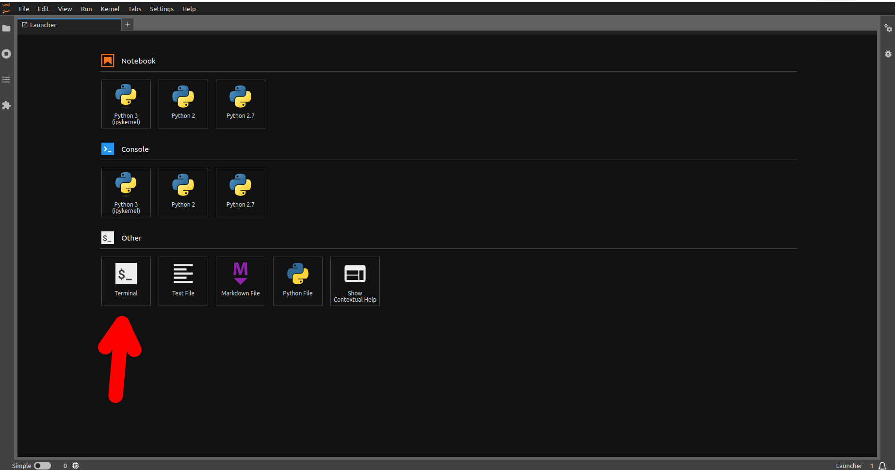

# Remote Access

The are several methods that can be used to access our workstations and services from outside of CAMH.

    - The Scinet SSH Tunnel
    - The SCC SSH Tunnel
    - Internal website access via remote.camh.ca
    - Limited terminal access via the jupyterhub
    - Limited terminal access via the rstudiohub

The most powerful and flexible options are the SSH tunnels, but they require the most initial set up.

If you need to find the name or IP address of a workstation that you can connect to in the lab once you're setup, you can see a complete list on [this page](https://github.com/TIGRLab/admin/wiki/IP-Addresses) (you must be logged in to github to view it).

## SciNet SSH Tunnel

**Required Accounts:** Lab account, SCC Access, SciNet account

You can request SciNet access by following [these instructions](https://github.com/TIGRLab/admin/wiki/Setting-Up-Lab-Access#getting-scinet-access) (must be logged in to github to view). Your lab username/password should automatically grant you access to the SCC now, but if you find you can't log in there reach out to Dawn or Kevin for assistance.

Once you have all the required accounts, you can set up the ssh tunnel by following these instructions:

  - [Mac/Linux](https://github.com/TIGRLab/admin/wiki/SciNet)
  - [Windows](https://github.com/TIGRLab/admin/wiki/Windows-MobaXTerm)

Note that you must be logged in to github to view either of those links.

## CAMH SSH Tunnel

**Required Accounts:** Lab account, SCC Access.

The instructions to request access to this tunnel and configure it [are here](https://github.com/TIGRLab/admin/blob/master/pdfs/Accessing%20the%20SCC%20with%20MobaXterm%20using%20a%20Jump%20Host%20-%20Short%20Version%20(No%20screenshots)%20-%20Enrollment%20Email%20version.pdf) (must be logged in to github to view).

## remote.camh.ca

**Required Accounts:** CAMH Account

**Required Software:** [Citrix Receiver](https://www.citrix.com/products/receiver/)

1. Go to https://remote.camh.ca
2. Login with your CAMH account
3. Once in, in the 'corporate' folder you'll find a shortcut for Google Chrome. If you double click this, and have Citrix Receiver properly installed, it will open a chrome browser that runs on CAMH's internal network.
4. Choose one of the sections below to complete your login.

#### Jupyterhub

**Required Accounts:** A lab account / SCC access

If you need a terminal inside CAMH or plan to use python you can follow these steps to access the jupyterhub.

- In the Chrome window you opened by following the steps above, go to https://jupyter.camh.ca/hub/login
- Log in with your SCC/TIGRlab account (your lab account and scc account are the same).
- Once you're in you should see the launcher panel, as soon in the image below. Just choose the 'terminal' option to open a terminal on the SCC.



- From here you can work on the SCC or you can ssh into a lab computer with `ssh yourkimelusername@yourmachinename.camhres.ca`

NOTE1: If you ever need to view files graphically (eg. html files from a QC pipeline's output), you can navigate to your home directory and symlink them there.
Eg.

```
# Do the below without being ssh-d into a Kimel lab computer
cd .
# Be sure to replace 'kimel_user' with your username and 'copied_folder' with your intended path.
ln -s /external/rprshnas01/tigrlab/scratch/kimel_user/copied_folder .
```

NOTE2: If you're on a mac you may find that certain keyboard characters (like the '@' symbol) dont work correctly over Citrix. You may be able to fix this with the following two commands. You'll have to restart Citrix after these changes for them to take effect.

```
cd $HOME/Library/Application\ Support/Citrix\ Receiver
sed -e 's/KeyboardLayout=(User Profile)/KeyboardLayout=US/' -i SAVE Config
```

#### The QC Dashboard

If you just need to do scan QC, once you've opened a chrome browser on the network by following the 'remote.camh.ca' instructions you can open the lab's QC dashboard by going to http://srv-dashboard.camhres.ca/

#### RStudiohub

If you want a terminal and/or plan to use rstudio then, after opening a chrome browser on the network by following the steps in 'remote.camh.ca', go to https://rstudio.camh.ca and login with your scc/lab account.

Once you're logged in you can open a terminal on the scc by clicking on the 'Tools' menu, and then 'Terminal' -> 'New Terminal'.

NOTE: You can follow the same symlinking procedure as in the Jupyterhub access section through the "terminal" tab on rstudio to copy your files over to the current directory so you can work on them

<!-- sign-off-sheet:start -->
<!-- sign-off-cadence:1 year -->
This shows the last time this page was reviewed to ensure it wasnt out of date.

| Name | Date | Notes |
|------|------|-------|
| TIGRLab | April 24th, 2023 | Needs update. |
| Dawn | May 12th, 2023 | Updated contents. |
| Dawn | Sept 23rd, 2024 | Updated img link, reworded a few things for clarity. |
| Dawn | July 29, 2025 | Updated example for symlinking scratch to SCC home. |
| Dawn | Oct 29, 2025 | Updated sections, added SCC tunnel instructions. |
<!-- sign-off-sheet:end -->
