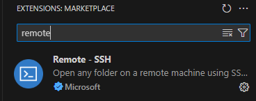
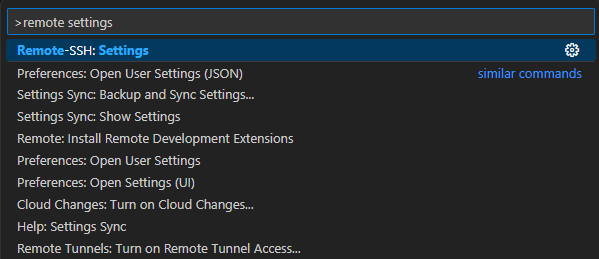

# Remote Access to the Kimel Lab Server using VS Code

This guide explains how to remotely connect to the Kimel Lab server using Visual Studio Code (VS Code).

VS Code is a powerful, IDE-like environment that supports a wide range of extensions to customize your experience and workflow. One particularly useful extension is Remote - SSH, which allows you to remotely access the Kimel cluster. With this extension, you can browse files, edit code, and use a terminal on the server—all within the VS Code interface. Combined with other extensions, this setup can significantly enhance your workflow.

---

## Table of Contents

1. [What You'll Need](#what-youll-need)   
2. [Setting Up VS Code](#setting-up-vs-code)
    1. [Remote-SSH](#remote-ssh)
3. [Remoting In](#remoting-in)
4. [Navigating](#navigating)
5. [Extensions](#extensions)
    1. [Live Preview](#live-preview)
    2. [NiiVue](#niivue)
    3. [Jupyter](#jupyter)

---

## What You'll Need

- [Visual Studio Code](https://code.visualstudio.com/download) installed on your system.
- Remote access to the Kimel system, including a completed SSH config file and all required credentials. This includes an Alliance Canada account, DUO 2-factor authentication, and the necessary CAMH/Kimel accounts.

If you're missing any steps for remote login, please refer to the [admin wiki](https://github.com/TIGRLab/admin/wiki/SciNet). This guide assumes those steps have already been completed.

## Setting Up VS Code

Launch VS Code and configure the recommended settings. Once open, your workspace should look similar to the image below.

### Remote-SSH

The first and most important extension you'll need is **Remote-SSH**. Click on the Extensions tab on the left (as indicated by the pink arrow below) and search for "Remote-SSH" by Microsoft.

After installation, you'll see a new **Connect to Host** button in the lower-left corner (highlighted by the yellow arrow). Click it to start configuring your SSH setup for tunneling through SciNet and into the Kimel cluster.

Next, select **Configure SSH Hosts**. Your menu options may vary depending on your current config setup.

Now, choose the path to your SSH config file—this should be the same one you'd typically use to SSH into SciNet or Kimel. Open the file to confirm that you can view and edit hosts as needed. *Note: Changes made here will affect your actual config file.*

If you need help setting up your config file, reach out to a member of the TigrCats team or consult the [admin wiki](https://github.com/TIGRLab/admin/wiki/SciNet).

Before connecting to a host, adjust your **Remote-SSH Connect Timeout** to ensure the connection has enough time to complete (especially with 2FA).

Press **Ctrl (or Cmd) + Shift + P** and search for `Remote-SSH: Settings`.

Scroll to **Remote-SSH: Connect Timeout**, and increase the value (e.g., change 15 to 150).

You're now ready to connect!

## Remoting In

By now, you should have a complete and functional config file (tested via terminal) and the **Remote-SSH** extension installed.

Click **Connect to Host** and select one of your configured options. In this example, we’ll use `niagara.scinet.utoronto.ca`, but you can use any working host.

You’ll be prompted to select the destination OS—choose **Linux**. At the bottom, you'll see a message indicating the SSH connection is in progress. **Always click on “Details”**—this opens the terminal-like interface where you can enter your passphrase, DUO 2FA, and any additional passwords.

You should now see a terminal window with input prompts. If the prompts don’t appear automatically, click inside the terminal window and type your responses directly.

Once authenticated, you’re connected!

Note that if the machine you're connecting to has a very old operating system, you may see a warning that says something like "The remote host does not meet the prerequisites for running VS Code server". Currently this happens with scclogin.camhres.ca, for example. You best option is to choose a different node, if you can, and suffer through with a traditional non-vscode terminal when you have to use those older nodes. If you have no other choice, though, you can downgrade your VSCode version to 1.98 or earlier, but be aware that this may create a host of other issues and cause a loss of a lot of functionality.

## Navigating

A major benefit of Remote-SSH is that it allows you to explore remote directories and open terminal sessions from within VS Code.

In the screenshot below:
- The **pink arrow** points to the File Explorer tab.
- The **yellow arrow** shows the Terminal icon.

Click the File Explorer, then **Open Folder**. Enter the path to the directory you’d like to open (e.g., your `SCanD` folder on Niagara). If you’re unsure of your current directory, type `pwd` in the terminal. Click OK once ready. Depending on your settings, you may need to reauthenticate.

You can now view your remote directories in the sidebar, open/collapse folders, and drag and drop files. You can also download or upload files between your local and remote machines via right-click or drag-and-drop.

Let’s explore some key extensions that can enhance your workflow.

## Extensions

Extensions are at the heart of any VS Code workflow. Below are three highly recommended tools for quality control, data analysis, and visualization.

**Note:** Extensions need to be installed separately for each remote host (but only once per host).

### Live Preview

**Live Preview** by Microsoft allows real-time rendering of HTML files. This makes it easy to view pipeline outputs and QC reports directly in VS Code.

Right-click an HTML file in your explorer and choose **Show Preview** to open it. You can also right-click the tab to open it in a new window for easier viewing.

### NiiVue

**NiiVue** is a lightweight, web-based viewer for neuroimaging data such as DICOMs and NIfTIs. While not a replacement for FSLEYES or FreeView, it's excellent for quick alignment checks during QC work or sanity checks during pipeline development.

Below is an example overlay of `aseg` (orange) on a T1-weighted image (grey).

### Jupyter

VS Code supports **Jupyter Notebooks**, making it easy to run Python-based fMRI analysis or stats work. To get started, install the **Jupyter**, **Python**, and **Data Wrangler** extensions.

 

Below is a notebook example with a Pandas DataFrame preview using Data Wrangler:

 
