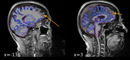

# Kimel Pipeline QC Guideline

This page is meant to provide guidance for both Kimel Staff and Researchers during quality rating/control of standard MR pipelines. It is meant to serve as a reference guide to many common issues observed during assessment of pipeline outputs. 

## Contents

- [fMRIPrep Anatomical](#fmriprep-anatomical)
  - [Good Examples](#examples-of-good-anatomical-scans)
  - [Issues](#examples-of-anatomical-scan-issues) 
- [fMRIPrep Functional](#fmriprep-functional)
  - [Good Examples](#examples-of-good-fmri-scans)
  - [Issues](#examples-of-functional-scan-issues) 
- [Freesurfer QC](freesurfer-qc)
- [Ciftify](#ciftify)


## fMRIPrep Anatomical

## Examples of Good Anatomical Scans

### Good BET Segmentation


**Things to look for:**
  1. Red outline (skullstrip) doesn’t include skull, outlines the brain
  2. Blue outline traces white matter area (lighter parts of brain)

**Relevant Issues**
  1. [Major Skullstrip Brain Clip](#major-skullstrip-brain-clip)
  2. [BET Segmentation Issue](#bet-segmentation-issue)
  3. [Skullstrip Clips Temporal Brain](#skullstrip-clips-temporal-brain)


### Good MNI Warp


**Things to look for:**
  1. “Participant” brain only includes brain (no skull being included)
  2. Make sure that the brain isn’t being stretched down into the cerebellum (indicative of BET segmentation issue)

**Relevant Issues**
  1. [MNI Warp Issues](#mni-warp-issues)
  2. [Minor MNI Edge Issues](#minor-mni-edge-issues)

#### Good Freesurfer Reconstruction


**Things to look for:**
  1. The red outline follows the brain’s outline, the cerebellum should be excluded
  2. The blue outline follows the white matter of the brain

**Relevant Issues:**
  1. [Under-inclusive Freesurfer Masking](#under-inclusive-freesurfer-masking)
  2. [Over-inclusive Freesurfer Masking](#over-inclusive-freesurfer-masking)

## Examples of Anatomical Scan Issues

#### Major Skullstrip Brain Clip


_The Cerebellum is excluded here_



_Part of the frontal cortex is excluded here_


_The brain is stretched down into the cerebellum_


**Conditions to mark as fail:**

This rating should always result in a Fail

**Description:**

FAST segmentation may exclude some regions of the brain. This may result in bad
fMRIPrep MNI transformations (as shown in image above)

**Possible Consequences:**

The data is unusable unless resolved as the Freesurfer step in fMRIPrep will receive a
inappropriately skull-stripped brain

**Recommendations:**

May be resolved via the following steps:
  1. Run fMRIPrep with ```--skull-strip-t1w skip``` to allow freesurfer to estimate a
brainmask from scratch
  2. If not, resolve via first masking the T1 ([ROBEX](https://www.nitrc.org/projects/robex) works well) then passing into
fMRIPrep. fMRIPrep will auto-detect that the image has already been skull-stripped

### BET Segmentation Issue


_Blue outline excludes parts of the white matter (arrows indicate where the white matter is excluded_

**Conditions to mark as fail:**

This rating should always result in a Fail

**Description:**

BET segmentation is excluding regions of either white of grey matter inappropriately. Red arrows in the image above show white matter regions being excluded from the white matter segmentation.

This issue is typically caused by too strong of a Bias field in the T1w image. It mostly occurs in Siemens scans where **Prescan Normalization** has not been applied.

**Possible Consequences:**

Unusable confounds data for WM/CSF/aCompCor. These values may be incorrectly
estimated or show up as NaNs in the fMRIPrep confounds TSV file.

**Recommendations:**

  - Re-run data with **T1-NORM** data, exclude un-normalized T1s.
  - Re-estimate confounds using the [Confound Re-estimation Pipeline](https://github.com/TIGRLab/TIGR_PURR/blob/master/recalculate_confounds.nf)

### Over-inclusive Freesurfer Masking

 

_This image should only have the brain. If the skull is shown then the skull hasn't been properly masked out_

**Conditions to mark as fail:**

This rating does not constitute a **Fail**. Only rate has fail if the red/blue outline extends into the skull

**Description:**

Freesurfer masking as shown in EPI-to-T1w or Freesurfer reconstruction views includes non-brain regions (skull).

**Possible Consequences:**

None, bbregister typically succeeds due to use of the grey/white matter contrast.

**Recommendations:**

None.

### Skullstrip Clips Temporal Brain

 

_The temporal lobe (shown with arrows) are being excluded from the outlining_

**Conditions to mark as fail:**

This rating should result in **Pass** as it occurs in specific scanning acquisitions and not much can be done. However the issue should always be indicated (i.e using drop-down in Niviz-Rater)

**Description:**

FAST segmentation may exclude temporal pole regions of the brain as shown in image
above

**Possible Consequences:**

The data is usable not a fail as there is any good fMRI signal at this temporal pole region

**Recommendations:**

May be resolved via adding freesurfer control points for local intensity inhomogeneity
correction

### Under-inclusive Freesurfer Masking

 

_The freesurfer reconstruction (blue/red outline) excludes part of the brain_

**Conditions to mark as fail:**
This rating should always result in a **Fail**

**Description:**

Freesurfer masking as shown in Surface reconstruction view miss brain regions in the
temporal pole. In the above image, the red/blue outline excludes some parts of the cortex in the top-part of the image.

**Caused by:** [Skullstrip Clips Temporal Brain](#skullstrip-clips-temporal-brain)

**Possible Consequences:**

None, as the fMRI signal always lost at this region and the cortical thickness difference at the temporal pole would not be plausible

**Recommendations:**

None, but flag these incidents

### MNI Warp Issues


_The MNI warp includes the skull_

**Conditions to mark as fail:**

This rating should always result in a Fail

**Description**

MNI transformation results in significant displacement of gyri inappropriately.

**Possible Consequences:**

**If using Ciftify outputs**, there are none as Ciftify re-estimates the non-linear transform

**If using fMRIPrep outputs**, may result in group analysis unintentionally using varying underlying brain regions across participants - potential loss of power/sensitivity.

**Recommendations:**

**If using Ciftify outputs:** None, check Ciftify non-linear transform

**If using fMRIPrep outputs:** This is a minor issue that may result in some smearing of signal when averaging. Researchers may choose to include this as a qc covariate

### Minor MNI Edge Issues


_Small part of the skull is being included in this warp._

**Conditions to mark as fail:**

Check the skullstrip image (see [Skullstrip Clips Temporal Brain](#skullstrip-clips-temporal-brain)), if it includes regions of the skull mark as **Fail**. Otherwise this issue is minor and can be marked as a **Pass**.

**Description:**

Some skull region may be incorporated into the MNI transformation. As a result crowns of gyri may be pushed in to allow the skull to fill.

**Caused by:** [Skullstrip Clips Temporal Brain](#skullstrip-clips-temporal-brain)

**Possible Consequences:**

**If using fMRIPrep:** Analyses using the MNI transform will include non-brain regions-reducing power/sensitivity of analyses

**If using Ciftify:** None, Ciftify re-estimates a non-linear transformation, that should be QC’d instead

**Recommendations:**

**If using Ciftify outputs:** None, check Ciftify non-linear transform
**If using fMRIPrep outputs:**
  1. Run fMRIPrep with ``` --skull-strip-t1w skip ``` to allow freesurfer to estimate a brainmask from scratch
  2. If (1) fails, resolve via first masking the T1 then passing into fMRIPrep. fMRIPrep will
auto-detect that the image has already been skull-stripped
  3. If (2) fails, we recommend that researchers incorporate this information into their QA rating process for later use in a QC rating sensitivity analysis.


## fMRIPrep Functional

## Examples of Good fMRI Scans

### Good EPI-to-T1w Alignment


**Things to look for:**

  1. The red/blue outlines should align with the functional image (darker/fuzzier image)
  2. Bright white parts of the functional image should be mostly excluded from the red/blue outline

**Relevant Issues:**

1. [Minor EPI-to-T1 mismatch](#epi-to-t1-mismatch)
2. [Clipping](#clipping)
3. [EPI Strong Bias Field](#epi-strong-bias-field)
4. [Overinclusive EPI Brainmask](#overinclusive-epi-brainmask)

### Good SDC Correction 


**Things to look for:**
  1. The “After” Image should more closely align with the blue outline than the “Before” image

**Relevant Issues:**

1. [SDC Mis-correction](#sdc-mis-correction)

## Examples of Functional Scan Issues

### Apparent Signal Dropout (Aging Population)


_Arrow shows dark region where there is brain (subcortical area)_

**Conditions to mark as fail:**

This rating should always result in a **Pass**. However indicate this in the QC-rating (i.e Using the drop-down in Niviz-Rater)

**Description:**

Apparent signal dropout that appears specifically in subcortical regions. This is not a processing/data acquisition artifact and instead may be a result of the aging process. It is not yet known whether this is pathophysiological or expected. **It is not a QC defect!**

**Possible Consequences:**

None

**Recommendations:**

None

### Inconsistent Intensity Patch


**Conditions to mark as fail:**

This rating should always result in a **Pass**. However indicate this in the QC-rating (i.e Using the drop-down in Niviz-Rater)

**Description:**

Sudden change in intensity in an EPI image. So far this has only been observed in multiband acquisitions.

_Update 2021-05-15: This doesn’t appear to be visible in the EPI images themselves. Possibly a visualization artifact?_

**May be confused with:** [Apparent In-plane Intensity Change](#apparent-in-plane-intensity-change)

**Possible Consequences:**

May induce spurious correlations due to intensity edge, especially if it is inconsistent across volumes

**Recommendations:**

1. Examine raw data for the artifact
2. If it does not exist it should be taken into account during the researcher’s QA process

### In-plane Intensity Change


**Conditions to mark as fail:**

This rating should always result in a **Pass**. However indicate this in the QC-rating (i.e Using the drop-down in Niviz-Rater)

**Description:**

Sudden intensity change in the EPI image that is consistent across all views (i.e there is a clear boundary between intensity regions). This is distinguishable from having an [Inconsistent Intensity Patch](#inconsistent-intensity-patch) due to the clear cut (a straight planar cut) here vs. unclear geometry in the other issue.

**May be confused with:** [Inconsistent Intensity Patch](#inconsistent-intensity-patch)

**Possible Consequences:**

May produce spurious correlations at intensity edge, especially if inconsistent across volumes

**Recommendations:**

1. Examine raw data for artifact
2. If does not exist should be taken into account during researcher QA

### EPI Signal Dropout


**Conditions to mark as fail:**

This rating should always result in a **Fail**.


**Description:**

Large signal dropout in the EPI image but not in the T1.

**Possible Consequences:**

Data may be unusable

**Recommendations:**
  1. Check raw EPI images for distortion/dropout to ensure it hasn’t been introduced by processing. If raw data contains dropout, then it should be black-listed via Dashboard QC

### Overinclusive EPI Brainmask


**Conditions to mark as fail:**
This rating should always result in a **Pass**. However indicate this in the QC-rating (i.e Using the drop-down in Niviz-Rater)

**Description:**
Non-brain regions included in EPI mask

**Possible Consequences:**

**If using Ciftify:** fMRIPrep confounds may be impacted
**If using fMRIPrep:** Non-brain regions may be included in brainmask. This may affect AROMA and confounds estimation.

**Recommendations:**
  1. None

### EPI Strong Bias Field


**Conditions to mark as fail:**
This rating should always result in a **Pass**. However indicate this in the QC-rating (i.e Using the drop-down in Niviz-Rater)

**Possible Consequences:**

Local spurious correlations may be induced

**Recommendations:**

  1. Examine the raw data to see if artifact persists
  2. Regardless of (1) Verify that this is limited only to the reference/dummy scans, if so then no further action is needed
  3. If all volumes present with some sort of bias field, data should be tossed

### Clipping


**Conditions to mark as fail:**

In some cases the bottom part of the cerebellum gets clipped, this is acceptable (a pass) but should still be annotated as having a Clipping issue. However, if any part of the cortex itself is clipped (bottom or top) this rating should _always_ result in a fail.

**Description:**

Data is clipped due to insufficient FOV or bad positioning of participant’s head

**Possible Consequences:**

Data is unusable

**Actions to take:**

1. Blacklist data and remove derivatives

### SDC Mis-correction


_The correction here pushes the brain inwards so that it ends up matching less with the blue outline_


**Conditions to mark as fail:**

This rating should _always_ result in a **Fail**. Notice that the corrected image pushes the brain inwards **away from the blue outline**.

**Description:**

SDC correction causes shifts in EPI away from the white matter segmentation (blue outline).
This may present as:
  - Apparent correction that increases distortion effect
  - Over-correction that over-compensates for distortion effect

**Possible Consequences:**

Will likely result in EPI-to-T1w mismatches.
_Will affect BOTH Ciftify and fMRIPrep!_

**Recommendations:**

1. Verify TOPUP directions of raw data
2. Always examine EPI-to-T1 registration to determine data usability/quality. If
EPI-to-T1w looks good, but SDC correction is less than ideal - the data is still likely good!
3. If EPI-to-T1w registration is compromised as a result of this, researcher QC should
handle as appropriate

### EPI-to-T1 mismatch


_The EPI (fMRI) brain has significant parts of it outside the red/blue outline. This constitutes a fail_


_The red/blue outline looks shifted away from the EPI (fMRI) brain. This constitutes a fail_


_Green arrows show where mismatches may occur BUT do not constitute a fail. These regions typically exhibit bad signal acquisition and so we expect gaps in these regions_

**Conditions to mark as fail:**
Mark as **Fail** if the red/blue outline does not overlay over the EPI (fMRI) image by a large margin.

**Note:** Mis-alignment is expected in the Orbitofrontal Region and Temporal regions (indicated in picture caption above, so those can be safely ignored! These areas typically have bad signal, missing signal occurs frequently).

**Description:**

EPI registered to T1 image shows significant mismatch. This is most likely due to
under-correction or [over-correction](#sdc-mis-correction) of EPI-induced distortion artifacts

**May be caused by:** [Over-correcting SDC](#sdc-mis-correction)

**Possible Consequences:**

Loss in power/sensitivity due to mismatched brain regions. Surface based-processing will also suffer due to possible inclusion of CSF/White matter

Recommendations:

1. Implement recommendations in [Over-correcting SDC](#sdc-mis-correction)
2. Researcher QA should handle as appropriate if resolutions of (1) are insufficient

### Background Peripheral EPI Artifact


_The background part of the image (non-brain areas) has bright lines._

**Conditions to mark as fail:**

This rating should always result in a **Pass**. However indicate this in the QC-rating (i.e Using the drop-down in Niviz-Rater)

**Description:**

Scanner artifacts present at the edges of an image. So far it has only been observed in OPT01_UP2, issue is known and has been resolved.

**Possible Consequences:**

Artifact may distort EPI signal within brain, it is unknown what the effect is

**Recommendations:**

1. Researcher QA should handle as appropriate, possibly through a sensitivity analysis
to confirm whether artifact leaks into brain tissue

## Freesurfer QC

For the OPT baseline freesurfer longitudinal outputs, we have used [visualqc](https://raamana.github.io/visualqc/index.html) to rate the quality of the pipeline output. Visualqc provides a nice quick way to look at a list of scans and record notes about each, but has a few UI quirks that can be a nuisance. It allows you to rate scans as ‘good’, ‘minor error’, ‘major error’, and ‘fail’ as well as the less useful ‘review later’ and ‘I’m tired’. There is also a small notes box where a brief description of issues can be added. There are a few common pipeline errors we have found using this tool:

### Dura included in segmentation


**Description:**

  ● Non-cortical tissue (typically dura) is segmented as grey matter
  
  ● OPTIMUM: Commonly found in Parietal/Occipital regions
  
  ● Most common error observed in Freesurfer outputs
  
  ● Typically coded as a ‘minor error’ - something for the researcher to be aware of when using the data. However this is not a failing criterion
  
**Possible Consequences:**

Cortical thickness over-estimates

**Recommendations:**

  ● Data is still usable, however the user may exercise caution through a sensitivity
analysis or including the minor error category as a covariate.

### Unassigned/Missed Cortical Tissue


**Description:**

Area of the cortex has not been segmented/assigned to a parcel. Example above is
classified as a ‘major error’. A possible cause of this error is clipping of the brain within the brainmask resulting in regions of the cortex being excluded during the Freesurfer segmentation step.

**Possible Consequences:**

Underestimation of cortical volume

**Recommendations:**

  ● Sensitivity analyses it data is not being corrected
  
  ● If fixing:
  
   ○ If the underlying cause of mis-segmentation can be attributed to the **brainmask.mgz** file clipping the brain. Then you may try the following steps:

   i. mri_convert the T1.mgz to a NIFTI file
      
   ii. Run an alternative skull-strip tool (i.e ROBEX) to generate a better brainmask
      
   iii. Convert the result using mri_convert into brainmask.mgz
      
   iv. Re-run freesurfer
      
   ○ If this is just a pial segmentation issue then follow the guide on: [Fixing Freesurfer pial surfaces](https://surfer.nmr.mgh.harvard.edu/fswiki/FsTutorial/PialEdits_freeview)

## Ciftify

### EPI to T1 registration (MNI)


**Description:**

Apparent alignment issues between the MNI-transformed version of the EPI and T1 data.
Note that this may be a consequence of the visualization method. EPI to T1 alignment
should be double checked via fMRIPrep (and cross-referenced to fMRIPrep participants.tsv). Both the T1 and EPI undergo the same MNI transformation.
**Add sub-mm flag issue, rerun fmriprep w/o sub-mm**

**Possible Consequences:**

Non-Grey Matter voxels projected onto surface

**Recommendations:**

  - Check the alignment of the EPI to T1 in fMRIPrep. This may not be a real issue
  - If issue is real, utilize a sensitivity analyses to account for effect of data with registration quality issues


### Bad seed-network maps


**Description:**

Seed correlation maps (i.e DMN as above) do not show any brain functional network
structure.

**This is not a real issue.** The data displayed by Ciftify has not been cleaned, the preferred approach would be to clean your data first then visualize seed correlation maps.

**Possible Consequences:**

None

**Recommendations:**

1. Run ```ciftify_clean_img``` first on your data then re-visualize to confirm.
