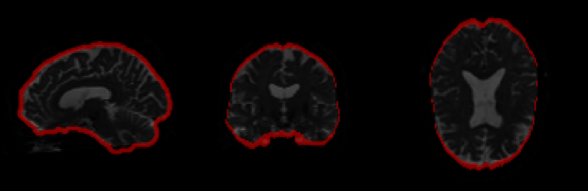

# Qsiprep QC Guideline

## Intro

This page is meant to provide guidance for researchers during quality rating/control of qsiprep outputs. It is meant to serve as a reference guide to many common issues observed during assessment of qsiprep pipeline outputs.

These quality control images are accessed by uploading the output qsiprep folder to [https://www.nipreps.org/dmriprep-viewer/#/](https://www.nipreps.org/dmriprep-viewer/#/). As long as there are dwiqc.json files in the root of the qsiprep output folder and in each of the subjects dwi output folders, the page should load with the entire study’s outputs. From this point, you can access the sidebar and go through each participant’s QC outputs, rating them as you go (either locally with your own spreadsheet or using the dmriprep viewer’s rating controls).

## What to Look For

### Motion and distortion correct DWI file

This is the **outputted motion and distortion corrected dwi image**, ie the final output nifti from qsiprep. You can scroll through the volumes of the nifti file to see the scan over time. Over the course of the scan you should notice that the brain has been corrected to not move too much from volume to volume, and that the image has been cleared of any distortion that might come up in the scanner. Basically, the diffusion file should look like its been normalized across volumes, and normalized compared to the other outputted dwi files from the same study (so that the analysis can go smoothly).

**Good Example:**

Description: Slices from the preprocessed diffusion data output. This is the final image output of the pipeline, so it has been motion corrected, denoised, bias corrected, etc. So, this is the first image you should be checking to see if anything went wrong with those steps, namely if it has been distorted too much, cut off, etc. In this case, the images clearly resemble the shape of a brain and there are little to no artifacts visible outside of the brain.

**Intermediate Example:**

Description: In this case the stretching artifact is still visible, however it does not significantly alter the shape of the brain. In addition, the brain mask generated still resembles the shape/outline of a brain and is mostly unaffected by the stretching artifact. Thus, the scan was passed. 

**Bad Example:**

Bad Distortion Example:

>>>>>  gd2md-html alert: inline image link here (to images/image4.png). Store image on your image server and adjust path/filename/extension if necessary.  (<a href="#">Back to top</a>)(<a href="#gdcalert5">Next alert</a>) >>>>> 

Description: The corrected DWI shows significant stretching, distorting the shape of the brain. This may cause problems such as the Brain mask detected and outlining the stretching artifact rather than the brain itself. In addition the corrected DWI shows that part of the signal is cut off around the cerebellum/ occipital lobe area.

Framewise Displacement Graph

The framewise displacement graph displays the **time series of framewise displacement** in blue and **RMS of head translation** in red. Ie, this is a metric for getting a general idea of the motion of the participant over the course of the scan. Motion is a very critical metric when doing quality control for neuroimaging data, so this needs to always be checked for the participants scanned.

Since this uses similar motion metrics as other nipreps outputs, this should be similar to you if you’ve seen framewise displacement in, say, an fmriprep output html file. Similarly to fmriprep, having a hard cutoff metric for where the FD should lie under is difficult since it can vary depending on the study goals, participants, and scanners. A general guide is to make sure that most of the FD lies under the 0.5 range, but I would suggest discussing your own metric depending on the study.

**Good Examples:**

Description: The y axis has a relatively low maximum value, indicating overall lower levels of motion. The two traces do not significantly diverge from each other, with generally similar peaks and troughs. 

**Bad Examples:**

Description: The y axis has a relatively high maximum value, indicating a higher degree of motion. In addition the two traces should somewhat overlap each other, however the two lines clearly diverge.

### Q-space sampling (original vs corrected)

This is a before and after look at the **sampling of all the q-space coordinates** from the diffusion data. The highlighted ball in red is the currently selected volume, which can be controlled via the slider under the “Corrected dwi” section. 

This is an easy check; all you need to verify is that the points are evenly spaced out before and after, i.e. it resembles a ball. It is very uncommon for this to mess up, so uncommon that we weren’t able to find a bad example in our datasets to show off here!

**Good Examples**

Description: Compare the two images by rotating the images around and ensuring that they both generally make out the shape of a ball as seen above. 

### Brain mask computed on T1w, and mapped to B0

**Good Example:**

Description: The brain mask creates a clear outline of the brain, with no significant deviations. Ensure to scroll through each of the sections, ensuring that the brain mask has correctly registered to the brain’s shape at each slice. 

**Intermediate Example:**

Description:

Brain mask detected stretching from the corrected DWI, BUT the brain mask is not significantly affected, so this was still passed.

**Bad Example:**

Mask detects stretching from corrected DWI

### Description: Stretching visible in the corrected DWI was detected by the mask. The resulting mask highlights a region completely outside of the brain.

### Tensor: Color FA mapped on B0 (checked that the tracts are facing a reasonably correct direction)

**Good Example:**

Description: In this case, each of the different directions as indicated by the different colors are localized to their own locations and discernible from each other. For example the sagittal section shows a clear separation between the green and red tracts. 

**Bad Example:**

Description:

Rather than having distinct and isolated segments of red, green and blue, they are overlapping strongly. These regions should be isolated and easily discernible from each other.
